# Connectivity Tests

## Routing Baseline — Before ACLs

The purpose of this test is to verify that inter-VLAN routing is
working correctly before implementing access control lists (ACLs).

R1's four VLAN gateway subinterfaces were verified as up/up.

### Router Interface Verification

The following screenshot confirms that the VLAN subinterfaces on R1
are operational.

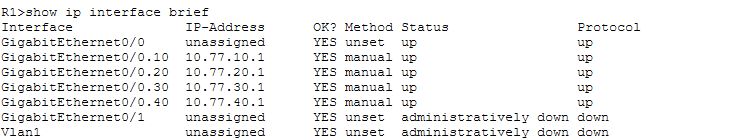

### Connectivity Results

| Source | Destination | Test | Expected | Actual |
|---|---|---|---|---|
| Employee PC | 10.77.10.1 | Ping | Success | Passed, 0% loss |
| Employee PC | 10.77.40.10 | Ping | Success | Passed, 0% loss |
| Guest PC | 10.77.20.1 | Ping | Success | Passed, 0% loss |
| Guest PC | 10.77.40.10 | Ping | Success | Passed, 0% loss |
| Admin PC | 10.77.30.1 | Ping | Success | Passed, 0% loss |
| Admin PC | 10.77.40.10 | Ping | Success | Passed, 0% loss |

### Employee Connectivity Evidence

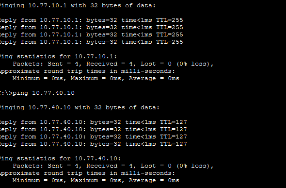

### Guest Connectivity Evidence

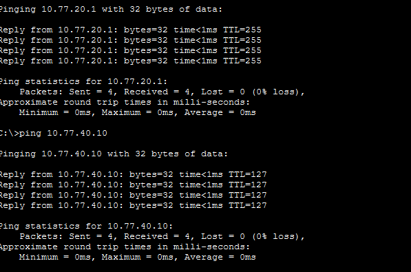

### Admin Connectivity Evidence

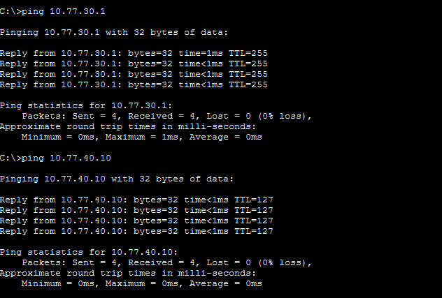

### Result

All three PCs successfully reached their respective default gateways
and the web server at 10.77.40.10.

Before ACLs were applied, guest-to-server ping succeeded. After ACLs were applied, guest access was blocked as recorded below.

This establishes the routing baseline before security restrictions
are applied.

## After applying ACLs

| Source | Test | Expected | Actual |
|---|---|---|---|
| Employee | HTTP to 10.77.40.10 | Page loads | Page loads |
| Employee | Ping 10.77.10.1 | Success | Success |
| Employee | Ping 10.77.40.10 | Blocked | Blocked |
| Employee | Ping 10.77.30.10 | Blocked | Blocked |
| Guest | HTTP to 10.77.40.10 | Fails | Fails |
| Guest | Ping 10.77.20.1 | Success | Success |
| Guest | Ping 10.77.40.10 | Blocked | Blocked |
| Guest | Ping 10.77.10.10 | Blocked | Blocked |
| Guest | Ping 10.77.30.10 | Blocked | Blocked |
| Admin | HTTP to 10.77.40.10 | Page loads | Page loads |
| Admin | Ping 10.77.40.10 | Success | Success |

### Verified configuration

- EMPLOYEE-IN is applied inbound on R1 Gi0/0.10.
- GUEST-IN is applied inbound on R1 Gi0/0.20.
- Permit and deny counters show matching traffic.
- R1 configuration was saved to startup-config.

### ACL configuration evidence

The screenshots below document rule matches and where the ACLs are applied. Match counters support verification of traffic filtering; they do not identify every test or prove that an HTTP page rendered.

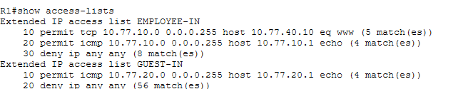

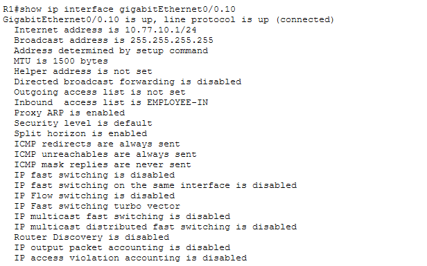

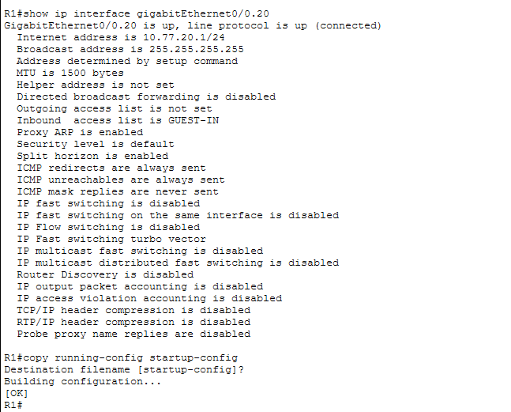

### Browser evidence

The uploaded screenshots show the following outcomes at `http://10.77.40.10`. The lab author's filenames identify PC0 as employee, PC1 as guest, and PC2 as admin.

| Source | Screenshot observation |
|---|---|
| Employee (PC0) | Server webpage displayed |
| Guest (PC1) | Request Timeout |
| Admin (PC2) | Server webpage displayed |

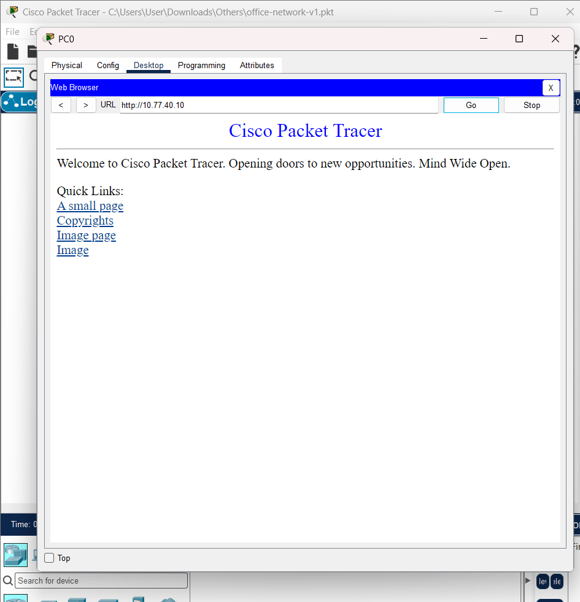

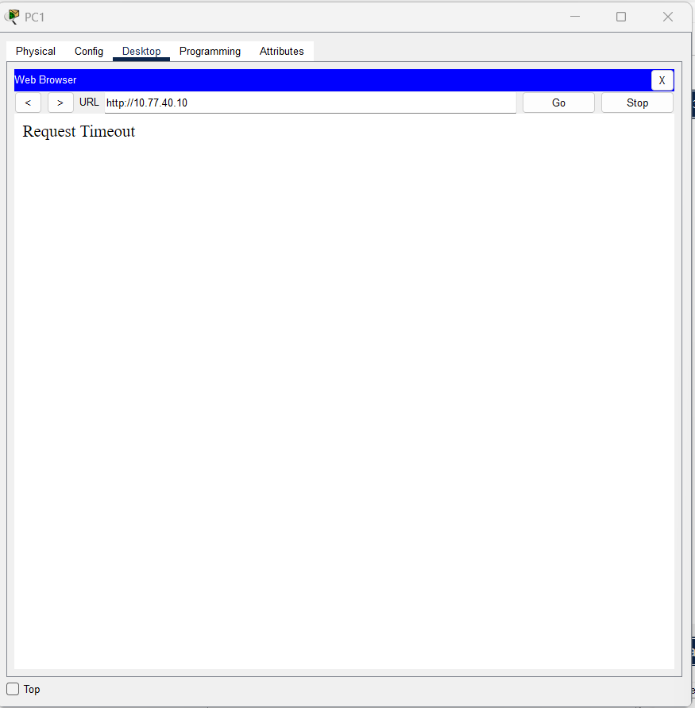

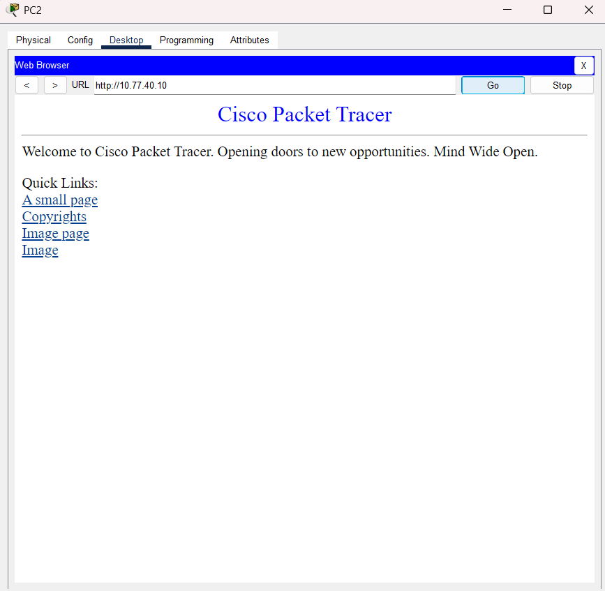

These browser outcomes are consistent with the configured ACL policy and existing ACL-counter evidence. The simulation has not been independently rerun as part of the documentation review.

### Post-ACL ping evidence

These screenshots are separate from the pre-ACL baseline images linked earlier.

**Employee:** gateway `10.77.10.1` responds; server `10.77.40.10` and admin host `10.77.30.10` return destination-host-unreachable responses from R1.

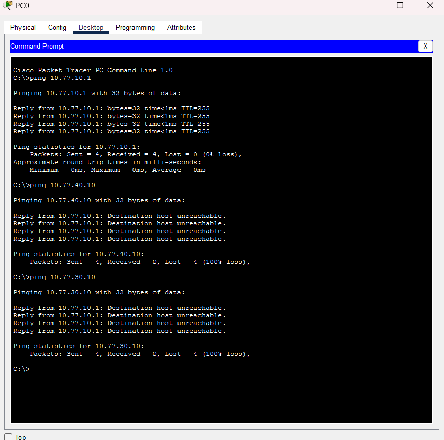

**Guest:** its own gateway `10.77.20.1` responds with 0% packet loss. Pings to server `10.77.40.10`, employee `10.77.10.10`, and admin `10.77.30.10` each return destination-host-unreachable responses from R1 (`10.77.20.1`) and 100% packet loss. The updated screenshot now covers the host addresses in the test matrix.

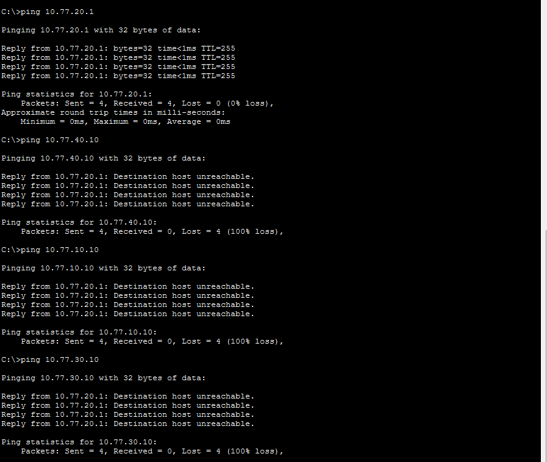

**Admin:** server `10.77.40.10` responds with 0% packet loss.

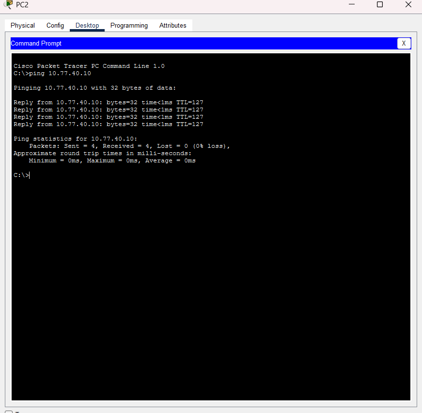

### Current limitations

- IPv4 ACLs filter traffic entering R1 from employee and guest VLANs.
- Traffic within the same VLAN does not pass through these ACLs.
- Administrator and server VLANs do not yet have inbound ACLs.
- Internet connectivity and cloud integration are not implemented.

For reconstruction steps, see the [Packet Tracer rebuild guide](lab-setup.md).
