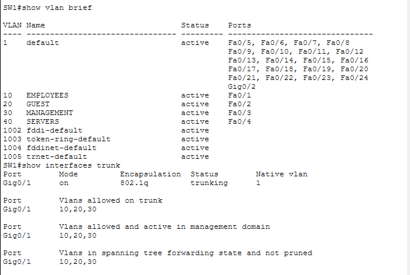
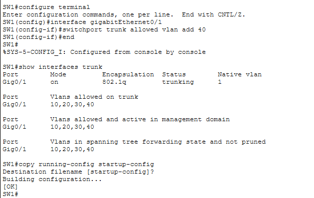
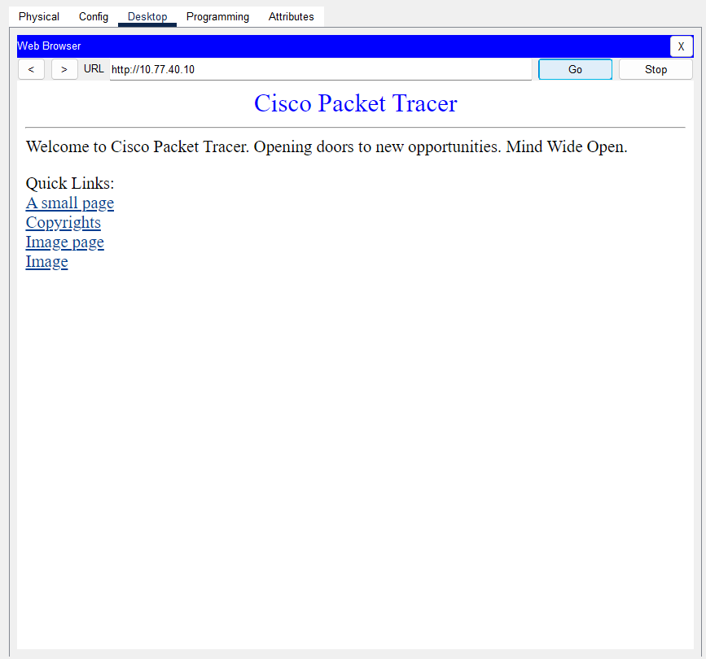

# Incident 001: Server VLAN excluded from trunk

**Type:** Planned fault-injection and recovery exercise  
**Environment:** Cisco Packet Tracer 9.0.1.0858; fictional small-business lab  
**Status:** Recovered based on configuration evidence and lab-author validation  
**Outage start/end times:** Not recorded  
**Outage and recovery duration:** Not measured

## Summary

A deliberate change removed server VLAN 40 from SW1's Gi0/1 trunk to R1. VLAN 40 remained active on the switch and the server access port remained assigned to it, but the trunk could no longer carry its traffic to the router. The lab author reports that a fresh admin HTTP request to 10.77.40.10 failed during this condition.

Adding VLAN 40 back to the trunk restored the allowed list to 10,20,30,40. The screenshot confirms VLAN 40 forwarding and a successful configuration save. The lab author reports a fresh successful admin browser request after restoration and confirms that guest HTTP access remained blocked.

This was an intentionally induced lab fault, not an unplanned production incident.

## Topology and affected service

| Component | Role |
|---|---|
| SW1 Gi0/1 | 802.1Q trunk to R1 Gi0/0 |
| SW1 Fa0/4 | Web-server access port in VLAN 40 |
| R1 Gi0/0.40 | Server VLAN gateway, 10.77.40.1/24 |
| WEB-SERVER | Internal HTTP service, 10.77.40.10 |
| ADMIN-PC | Management VLAN 30, planned address 10.77.30.10 |

Observed impact was loss of the admin's HTTP access to the internal server. The fault would also prevent other routed clients from reaching the server through this trunk; separate employee-outage results were not supplied for this report.

Management VLAN 30 remained in the allowed list. Continued management connectivity was expected from the design, but no during-outage SSH or management-ping result is claimed here.

## Exercise sequence

No timestamps were collected; this table records order only.

| Stage | Action or observation | Evidence basis |
|---|---|---|
| Fault injection | VLAN 40 deliberately excluded from SW1 Gi0/1 | Exercise procedure and resulting trunk state |
| Symptom | Fresh admin HTTP request failed | Lab-author report; no failure screenshot uploaded |
| Diagnosis | VLAN 40 active on Fa0/4, but trunk allows only 10,20,30 | Outage screenshot |
| Repair | Add VLAN 40 back to Gi0/1 | Recovery CLI screenshot |
| Network verification | Trunk allows and forwards 10,20,30,40 | Recovery CLI screenshot |
| Save | Running configuration copied to startup-config with OK | Recovery CLI screenshot |
| Application verification | Fresh admin HTTP request succeeds | Browser screenshot and lab-author confirmation |
| Policy regression check | Guest HTTP remains blocked after restoration | Lab-author report; no exercise-specific screenshot |

Do not infer elapsed time from file names, Git commits, or screenshot upload times.

## Diagnosis and root cause

The diagnosis compared two views of SW1:

```text
show vlan brief
show interfaces trunk
```

The first showed VLAN 40 named SERVERS as active, with Fa0/4 assigned.
The second showed Gi0/1 still trunking with 802.1Q, but with only
10,20,30 allowed, active, and forwarding.

**Root cause:** VLAN 40 was absent from the trunk allowed list. Its
traffic could not cross the link to R1, preventing the routed path
between the admin subnet and the server subnet.

A VLAN being present in the VLAN database and a physical link remaining
up are not sufficient to prove that the VLAN can cross a trunk. No
change to the server IP address, server VLAN membership, or access
policy was needed for this repair.

### Fault-state evidence



The failed browser request was confirmed by the lab author but was not
captured in an uploaded screenshot. The successful page below is
recovery evidence, not evidence of failure.

## Reproduction and recovery commands

For a future controlled reproduction, work in a copy of the known-good
Packet Tracer project. On SW1, the planned fault-injection command is:

```text
enable
configure terminal
interface gigabitEthernet0/1
 switchport trunk allowed vlan remove 40
end
```

Do not save the deliberately faulty running configuration to
startup-config.

The recorded recovery used:

```text
configure terminal
interface gigabitEthernet0/1
 switchport trunk allowed vlan add 40
end
show interfaces trunk
copy running-config startup-config
```

Using `add 40` retains VLANs 10,20,30 while restoring the server VLAN.
An unqualified `switchport trunk allowed vlan 40` would replace the
list and create a different outage.

### Restored trunk and saved configuration



## Recovery validation

| Check | Result | Confidence and limitation |
|---|---|---|
| VLAN 40 restored to allowed list | Passed | Visible in CLI screenshot |
| VLAN 40 forwarding on Gi0/1 | Passed | Visible in CLI screenshot |
| Switch configuration save | Passed | OK shown after copy command |
| Admin HTTP to 10.77.40.10 | Passed | Page displayed; author confirms a fresh request after restoration |
| Guest HTTP remains blocked | Passed, author-reported | No new guest screenshot from this exercise |
| Admin ping, employee HTTP, or SSH during recovery | Not recorded in this report | Not inferred from other milestones |
| Recovery time | Not measured | No start/end timestamps |

### Application recovery evidence



The browser capture shows the URL and rendered page but not the client
IP or a timestamp. Attribution to ADMIN-PC and confirmation that this
was a fresh post-recovery request come from the lab author.

## Prevention and follow-up improvements

The following are proposed improvements, not controls already implemented:

- Before a trunk change, record its allowed VLAN list and identify which
  application and management paths depend on each VLAN.
- Use explicit `add` or `remove` operations when modifying part of an
  existing allowed list; review the intended difference.
- After a change, check both VLAN membership and trunk forwarding,
  then perform fresh application requests.
- Include negative tests, such as guest HTTP denial, to ensure recovery
  does not accidentally relax security policy.
- For the next exercise, record fault-injection time, detection time,
  repair time, and first successful fresh application request.
- Add service monitoring in a later project phase; this exercise used
  manual checks and does not demonstrate automated outage detection.

## Lessons learned

This exercise demonstrated how a selective trunk misconfiguration can
break an application while the VLAN still exists and the trunk remains
up. Recovery required a targeted network change, followed by application
validation and a check that guest restrictions remained effective.

The results support a documented diagnosis and recovery procedure. They
do not establish a recovery-time objective, availability percentage,
automated failover capability, or production resilience.

## Related documentation

- [Lab rebuild guide](../lab-setup.md)
- [Connectivity tests and access-policy baseline](../connectivity-test.md)
- [Restricted SSH administration](../ssh-management.md)
