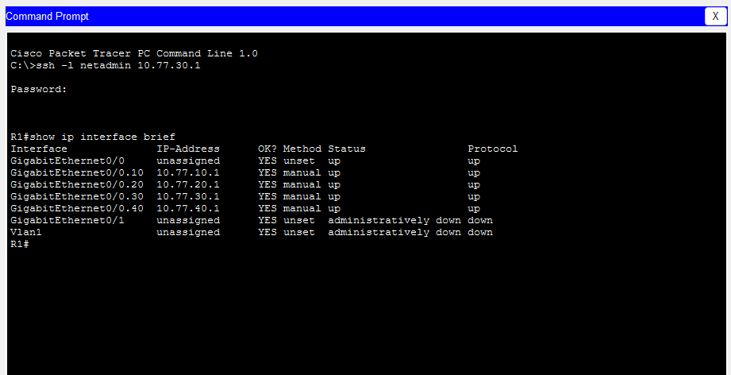
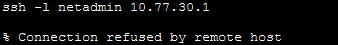
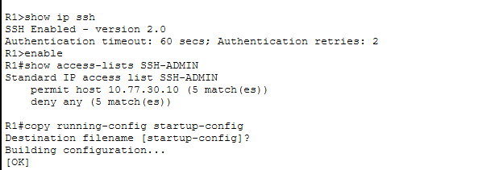
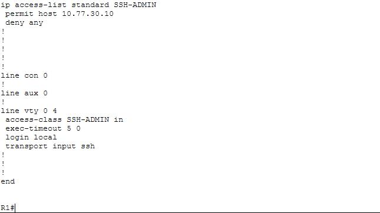
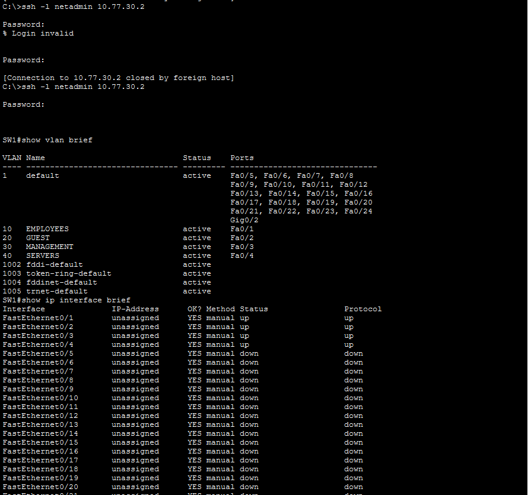
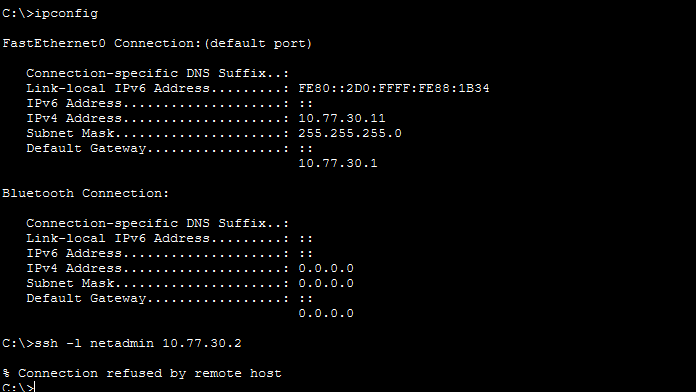
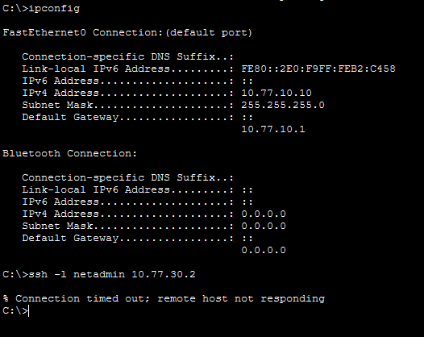
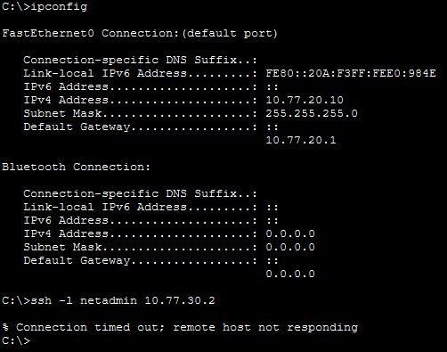
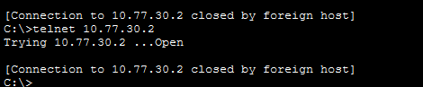

# Restricted SSH Administration

## Objective

Allow the administrator workstation at 10.77.30.10 to manage R1
and SW1 through SSH. Restrict their VTY lines to the authorized
source IP and SSH transport.

This milestone was implemented in Cisco Packet Tracer 9.0.1.0858.

## Management settings

| Setting | Value |
|---|---|
| R1 management address used for testing | 10.77.30.1 |
| SW1 management SVI | VLAN 30, 10.77.30.2/24 |
| SW1 default gateway | 10.77.30.1 |
| VTY lines covered | R1: 0–4; SW1: 0–15 |
| Authorized workstation | 10.77.30.10 |
| SSH username | netadmin |
| Intended administrator privilege level | 15; see SW1 export note below |
| SSH version | 2 |
| Authentication timeout | 60 seconds |
| Authentication retries | 2 |
| Idle session timeout | 5 minutes |
| VTY access list | SSH-ADMIN |

## R1 configuration procedure

These commands are entered in R1's CLI. Replace
`YOUR_LAB_PASSWORD` with a unique lab-only password before running
the username command. The placeholder is not a working credential.

```text
enable
configure terminal
hostname R1
ip domain-name lab.example
username netadmin privilege 15 secret YOUR_LAB_PASSWORD
crypto key generate rsa
```

When prompted for the RSA key size, enter `2048`.

Continue:

```text
ip ssh version 2
ip ssh time-out 60
ip ssh authentication-retries 2

ip access-list standard SSH-ADMIN
 permit host 10.77.30.10
 deny any
exit

line vty 0 4
 login local
 transport input ssh
 access-class SSH-ADMIN in
 exec-timeout 5 0
exit

end
copy running-config startup-config
```

These are setup instructions for a router without an existing SSH
configuration. Do not regenerate existing RSA keys merely to
verify SSH.

## How the restriction works

- `login local` authenticates sessions against R1's local user database.
- `transport input ssh` permits SSH and excludes Telnet on the VTY lines.
- `access-class SSH-ADMIN in` permits remote terminal access only
  from source IP 10.77.30.10.
- `exec-timeout 5 0` closes idle sessions after five minutes.
- The employee and guest interface ACLs remain in place.

The VTY ACL matches the source IP, not the identity of a physical
computer. The username and password provide an additional
authentication requirement.

## R1 verification procedure

From ADMIN-PC at 10.77.30.10:

```text
ipconfig
ssh -l netadmin 10.77.30.1
```

After authentication, run:

```text
show ip interface brief
exit
```

Then test Telnet:

```text
telnet 10.77.30.1
```

To test the VTY source restriction independently of the employee
and guest interface ACLs:

1. Close the active SSH session.
2. Temporarily change ADMIN-PC's address to 10.77.30.11.
3. Keep the subnet mask and default gateway unchanged.
4. Attempt SSH to 10.77.30.1.
5. Restore ADMIN-PC to 10.77.30.10.
6. Confirm SSH succeeds again.

On R1's local CLI, inspect:

```text
show ip ssh
show access-lists SSH-ADMIN
show running-config
```

## R1 recorded results

| Test | Expected | Observed |
|---|---|---|
| SSH from 10.77.30.10 | Allowed with valid credentials | Login succeeded; reached R1# |
| Execute a command over SSH | Command succeeds | show ip interface brief displayed router interfaces |
| SSH from temporary address 10.77.30.11 | Rejected | Connection refused |
| Restore 10.77.30.10 and retry SSH | Allowed | Login succeeded |
| Telnet from 10.77.30.10 | No usable login session | Connection immediately closed without a login prompt |
| SSH protocol verification | Version 2 | show ip ssh reports version 2.0 |
| VTY configuration verification | SSH only, restricted source | Required VTY settings confirmed |

Packet Tracer displayed “Open” before closing the Telnet connection.
The observed result is recorded as an immediately closed session.
The `transport input ssh` configuration confirms that only SSH is
allowed on these VTY lines.

## R1 evidence

### Authorized SSH and Telnet test

The linked image shows a successful SSH session to R1 and remote command execution. Despite its filename, this crop does not show the client's source IP or the Telnet attempt. The R1 Telnet closure and source IP were shown separately during the lab review; the table records those observations.



### Unauthorized source test

The lab operator reports that ADMIN-PC temporarily used
10.77.30.11 for this attempt. The screenshot shows the refusal
but does not display the source IP.



### SSH settings and ACL counters

Permit and deny counters show matching traffic. Counter values
are packet matches, not counts of successful logins.



### VTY configuration




## SW1 configuration procedure

SW1 uses a management SVI in VLAN 30. R1 remains the inter-VLAN router.
ADMIN-PC reaches SW1 directly within VLAN 30, so R1's interface ACLs
do not filter that same-subnet management connection.

The commands below describe the intended setup on a fresh switch.
They are documentation, not a claim that the sanitized export contains
every line. Do not regenerate existing SSH keys merely to verify the setup.
Replace the password placeholder with a unique lab-only credential.

On SW1's local CLI:

```text
enable
configure terminal
hostname SW1

interface vlan 30
 description MANAGEMENT-SVI
 ip address 10.77.30.2 255.255.255.0
 no shutdown
exit

ip default-gateway 10.77.30.1
ip domain-name lab.example
username netadmin privilege 15 secret YOUR_SWITCH_LAB_PASSWORD
crypto key generate rsa
```

When prompted for the RSA key size, enter `2048`. Continue:

```text
ip ssh version 2
ip ssh time-out 60
ip ssh authentication-retries 2

ip access-list standard SSH-ADMIN
 permit host 10.77.30.10
 deny any
exit

line vty 0 15
 login local
 transport input ssh
 access-class SSH-ADMIN in
 exec-timeout 5 0
exit

end
copy running-config startup-config
```

All VTY lines must be covered. The running configuration can display
them as two groups, `0 4` and `5 15`; both need the same restrictions.
The ACL named SSH-ADMIN on SW1 is independent of R1's ACL with that name.

### SW1 verification procedure

From ADMIN-PC at 10.77.30.10:

```text
ipconfig
ssh -l netadmin 10.77.30.2
```

After authenticating:

```text
show vlan brief
show ip interface brief
exit
```

Test Telnet from the same workstation:

```text
telnet 10.77.30.2
```

Close existing sessions before testing a new source IP. Temporarily
set ADMIN-PC to 10.77.30.11, retaining the /24 mask and gateway
10.77.30.1. Run `ipconfig` and retry SSH to 10.77.30.2; expect rejection.
Restore 10.77.30.10 afterward and confirm access succeeds.

From EMPLOYEE-PC and GUEST-PC, attempt SSH to 10.77.30.2; expect failure.
These routed tests are also subject to R1's employee and guest ACLs.
The .11 same-subnet test is the direct test of SW1's VTY source restriction.

On SW1's local CLI, inspect:

```text
show ip interface brief
show ip ssh
show access-lists SSH-ADMIN
show running-config
```

Check Vlan30's address and operational state, SSH version 2, ACL entries,
and restrictions on both VTY groups.

### SW1 recorded results

| Test or check | Observation | Evidence |
|---|---|---|
| Authorized SSH to 10.77.30.2 | Later authentication attempt succeeds; session reaches SW1# and executes commands | Admin-success screenshot |
| Source 10.77.30.11 to SW1 SSH | Connection refused; source IP is visible | Unauthorized-IP screenshot |
| Employee 10.77.10.10 to SW1 SSH | Connection times out | Employee screenshot |
| Guest 10.77.20.10 to SW1 SSH | Connection times out | Guest screenshot |
| Telnet to 10.77.30.2 | “Open” followed by immediate closure; no usable login session shown | Telnet screenshot |
| SSH configuration | Version 2, 60-second authentication timeout, two retries | Saved switch export |
| VTY configuration | Both 0–4 and 5–15 use local login, SSH-only transport, SSH-ADMIN, and five-minute idle timeout | Saved switch export |
| Management addressing | Vlan30 configured as 10.77.30.2/24, default gateway 10.77.30.1 | Saved switch export |

The authorized source .10 is reported by the lab author and was visible
in an earlier session capture. The latest admin-success screenshot does
not include `ipconfig`. It includes an initial failed authentication
attempt followed by a successful login; the failure's cause was not established.
No successful-login count is inferred from ACL counters.

### SW1 evidence

#### Authorized SSH session



#### Unauthorized management-subnet source



#### Employee and guest access attempts





#### Telnet attempt



The lab author identifies this as the admin Telnet test; the crop does
not display the source IP. The saved VTY configuration provides the
separate confirmation that SSH is the only permitted remote transport.

### SW1 configuration export note

The [sanitized SW1 export](../configs/SW1-running-config.txt) contains
the management SVI, SSH settings, source ACL, and restrictions on both
VTY groups. Its credential is redacted.

The latest successful SSH capture reaches `SW1#`, and the lab author
reports applying privilege level 15. However, the current text export
still omits `privilege 15` on the username line. That export has
intentionally been left unchanged for now at the lab author's request.
It should not be treated as an exact reproduction of the latest account
privilege setting. The fresh-setup instructions above state the intended
level explicitly.

These results are based on the lab author's screenshots and saved
configuration; the Packet Tracer simulation was not independently replayed.

## Scope and limitations

- This milestone covers remote administration of R1 and SW1. It does not establish a complete management-plane security policy.
- The VTY ACL restricts source addresses; it does not bind SSH exclusively to a particular destination address.
- A source-IP restriction alone does not establish device identity.
- The lab uses local authentication and a full-privilege administrator
  account. Centralized authentication and finer authorization are
  future improvements.
- The tests were performed by the lab author in Packet Tracer.

## Saved artifacts

The lab author reports saving both device configurations with
`copy running-config startup-config` and saving the Packet Tracer project.

The Packet Tracer project must also be saved through File > Save.
Configuration exports published to GitHub must have credentials
and password hashes redacted.
